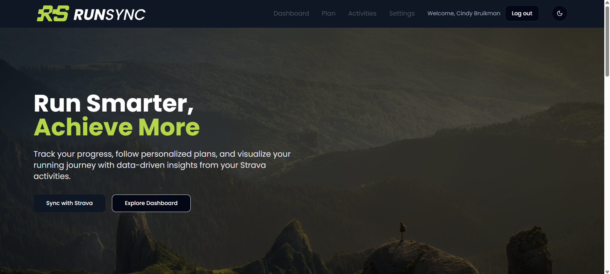

# RunSync


---

## 🖼️ Screenshot



---

## 🏃 Overview

**RunSync** is a modern running companion web app designed for recreational runners who want to train smarter using real performance data. The application connects with the Strava API and offers weekly planning, progress tracking, and AI-generated training plans tailored to your personal goals.

Whether you're just starting out or training for a 10K, RunSync helps you structure your runs, track your progress visually, and stay motivated with smart guidance — all in a clean, accessible UI.

---

## ✨ Key Features

- **Strava Integration** – Sync your running data with Strava to see real-time activity.
- **Weekly Plan View** – Personalized 7-day overview with progress indicators and day highlights.
- **Visual Stats** – Distance, duration, and pace visualized using Chart.js.
- **AI-Powered Plan Generator** – Create custom plans based on your experience, distance goal, and number of weeks.
- **Theme Toggle** – Switch between light and dark mode, with adaptive logo.
- **Responsive UI** – Clean and accessible layout for both desktop and mobile.

---

## 🎯 Purpose

The goal of RunSync is to empower everyday runners with structure and insight — without complexity. Using real data, RunSync bridges the gap between training intuition and smart planning by combining user-centered design with AI-driven feedback.

---

## 🧱 Tech Stack

### Frontend

- **Next.js** (App Router)
- **React**
- **Tailwind CSS**
- **Chart.js**
- **Strava API**

### Tooling

- VS Code
- GitHub & Git
- Node.js
- NPM
- Vercel (hosting)

### AI / Backend

- OpenAI GPT (via `/api/generate-plan`)
- JSON plan structure
- Custom prompt design for plan creation

### Database

- **Prisma ORM** – type-safe database access
- **Neon** – serverless Postgres database platform


---

## ⚙️ Installation

### Prerequisites

- Node.js (LTS)
- NPM

### Setup

```bash
git clone https://github.com/cindybruikman/runsync-next.git
cd runsync-next
npm install
npm run dev
```

Visit: [http://localhost:3000](http://localhost:3000)

---

## 🔐 Environment Variables

Create a `.env.local` file:

```env
OPENAI_API_KEY=sk-xxxxxx
```

---

## 🛠 Scripts

| Command         | Description                  |
| --------------- | ---------------------------- |
| `npm run dev`   | Start the development server |
| `npm run build` | Build the production app     |
| `npm start`     | Start the production server  |
| `npm run lint`  | Lint the codebase            |

---

## 🤝 Contributing

Pull requests are welcome! For suggestions or improvements, feel free to open an issue or submit a PR.

---

## 📄 License

This project is licensed under the MIT License.
